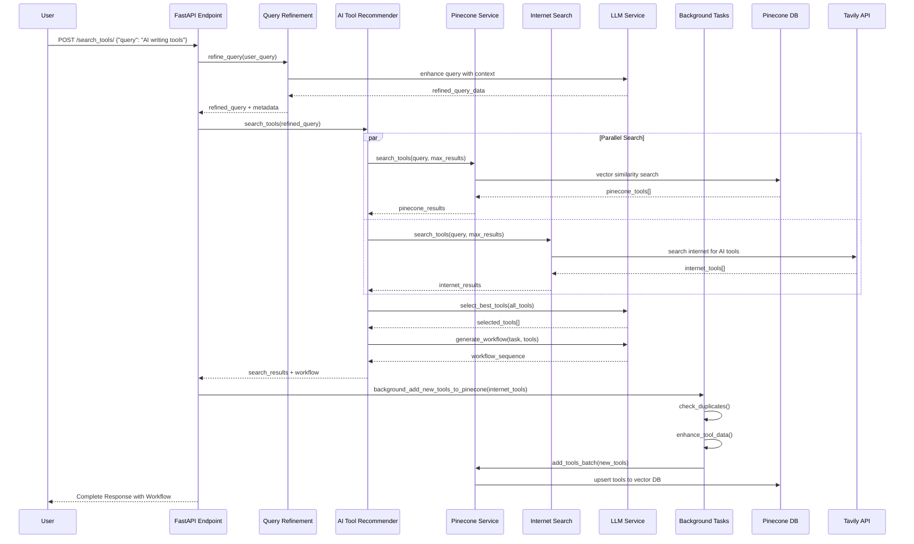
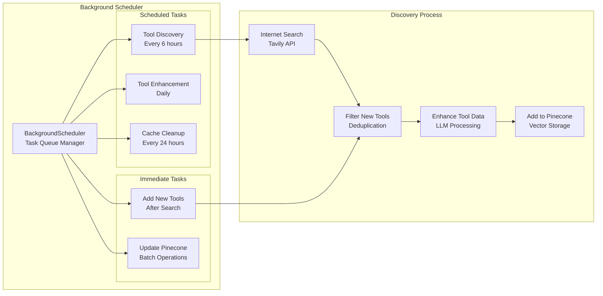
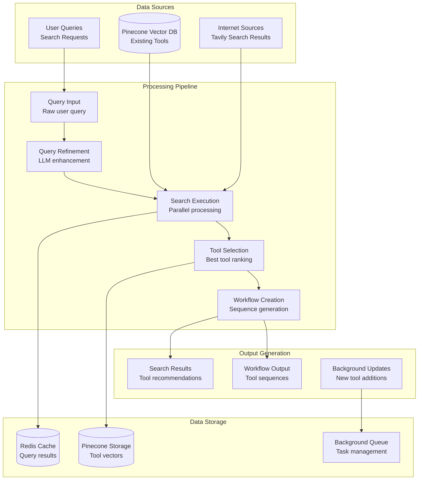

# AI Tool Recommender - Complete Architecture Diagram

## System Overview

The AI Tool Recommender is a comprehensive system that combines multiple AI tools from Pinecone Vector Database and Internet Search to create intelligent workflows. The system is organized into modular components with clear separation of concerns.

## Complete Architecture Diagram

```mermaid
graph TB
    %% External Services
    subgraph "External Services"
        TAVILY[Tavily API<br/>Internet Search]
        PINECONE[Pinecone Vector DB<br/>Tool Storage]
        OPENAI[OpenAI GPT-4o-mini<br/>LLM Service]
        REDIS[Redis Cache<br/>Query Caching]
    end

    %% FastAPI Application Layer
    subgraph "FastAPI Application Layer"
        MAIN[main.py<br/>FastAPI App]

        subgraph "API Routes"
            SEARCH_ROUTE["/search_tools/<br/>Main Search Endpoint"]
            HEALTH_ROUTE["/health/*<br/>Health Checks"]
            DISCOVERY_ROUTE["/discovery/*<br/>Tool Discovery"]
            EXCEL_ROUTE["/excel/*<br/>Excel Handler"]
            INTERNET_ROUTE["/internet/*<br/>Internet Search"]
        end
    end

    %% Core AI Agents
    subgraph "AI Agents Core (Modular Structure)"
        subgraph "LLM Services"
            LLM_SERVICE[SharedLLMService<br/>GPT-4o-mini Integration]
            LLM_INIT[llm/__init__.py<br/>LLM Exports]
        end

        subgraph "Discovery Services"
            DISCOVERY_SERVICE[ToolDiscoveryService<br/>Auto Tool Discovery]
            DISCOVERY_CONFIG[DiscoverySchedulerConfig<br/>Discovery Settings]
            DISCOVERY_INIT[discovery/__init__.py<br/>Discovery Exports]
        end

        subgraph "Validation Services"
            TOOL_VALIDATOR[ToolDataValidator<br/>Data Validation]
            TOOL_FORMATTER[ToolDataFormatter<br/>Data Formatting]
            VALIDATION_INIT[validation/__init__.py<br/>Validation Exports]
        end

        subgraph "Background Services"
            BG_SCHEDULER[BackgroundScheduler<br/>Task Management]
            BG_TASKS[Background Tasks<br/>• Tool Discovery<br/>• Pinecone Updates<br/>• Cache Cleanup]
            BG_INIT[background/__init__.py<br/>Background Exports]
        end

        subgraph "Core Utilities"
            QUERY_PIPELINE[QueryPipeline<br/>Query Processing]
            REDIS_CACHE[RedisCache<br/>Caching Layer]
            PERFORMANCE_MONITOR[PerformanceMonitor<br/>Metrics Tracking]
            ASYNC_WORKERS[AsyncWorkerPool<br/>Concurrent Processing]
        end
    end

    %% Tool Services
    subgraph "Tool Services"
        subgraph "Pinecone Service"
            PINECONE_SERVICE[PineconeService<br/>Vector Search & Storage]
            PINECONE_METHODS[Methods:<br/>• search_tools()<br/>• add_tool()<br/>• add_tools_batch()]
        end

        subgraph "Internet Search Service"
            INTERNET_SERVICE[InternetSearchService<br/>Tavily Integration]
            INTERNET_METHODS[Methods:<br/>• search_tools()<br/>• extract_pricing()<br/>• validate_tools()]
        end

        subgraph "AI Tool Recommender"
            AI_RECOMMENDER[AIToolRecommender<br/>Main Orchestrator]
            AI_METHODS[Methods:<br/>• search_tools()<br/>• generate_workflow()<br/>• select_best_tools()]
        end
    end

    %% Query Refinement
    subgraph "Query Refinement Service"
        QUERY_REFINER[QueryRefinementService<br/>Query Enhancement]
        REFINEMENT_METHODS[Methods:<br/>• refine_query()<br/>• extract_intent()<br/>• optimize_params()]
    end

    %% Data Flow
    MAIN --> SEARCH_ROUTE
    SEARCH_ROUTE --> QUERY_REFINER
    QUERY_REFINER --> AI_RECOMMENDER

    AI_RECOMMENDER --> PINECONE_SERVICE
    AI_RECOMMENDER --> INTERNET_SERVICE

    PINECONE_SERVICE --> PINECONE
    INTERNET_SERVICE --> TAVILY

    AI_RECOMMENDER --> LLM_SERVICE
    LLM_SERVICE --> OPENAI

    SEARCH_ROUTE --> BG_TASKS
    BG_TASKS --> DISCOVERY_SERVICE
    DISCOVERY_SERVICE --> INTERNET_SERVICE
    DISCOVERY_SERVICE --> PINECONE_SERVICE

    QUERY_PIPELINE --> REDIS_CACHE
    REDIS_CACHE --> REDIS

    %% Styling
    classDef external fill:#e1f5fe,stroke:#01579b,stroke-width:2px
    classDef api fill:#f3e5f5,stroke:#4a148c,stroke-width:2px
    classDef core fill:#e8f5e8,stroke:#1b5e20,stroke-width:2px
    classDef tools fill:#fff3e0,stroke:#e65100,stroke-width:2px
    classDef services fill:#fce4ec,stroke:#880e4f,stroke-width:2px

    class TAVILY,PINECONE,OPENAI,REDIS external
    class MAIN,SEARCH_ROUTE,HEALTH_ROUTE,DISCOVERY_ROUTE,EXCEL_ROUTE,INTERNET_ROUTE api
    class LLM_SERVICE,DISCOVERY_SERVICE,TOOL_VALIDATOR,TOOL_FORMATTER,BG_SCHEDULER,QUERY_PIPELINE,REDIS_CACHE,PERFORMANCE_MONITOR,ASYNC_WORKERS core
    class PINECONE_SERVICE,INTERNET_SERVICE,AI_RECOMMENDER tools
    class QUERY_REFINER services
```

## Detailed Workflow Diagram



## Background Task Flow



## API Endpoints Structure

```mermaid
graph TD
    subgraph "Main API Endpoints"
        SEARCH["/search_tools/<br/>Main search endpoint"]
        HEALTH["/health/*<br/>Service health checks"]
        DISCOVERY["/discovery/*<br/>Tool discovery management"]
        EXCEL["/excel/*<br/>Excel-style tool addition"]
        INTERNET["/internet/*<br/>Direct internet search"]
    end

    subgraph "Search Endpoint Features"
        QUERY_REFINEMENT[Query Refinement<br/>LLM-enhanced queries]
        PARALLEL_SEARCH[Parallel Search<br/>Pinecone + Internet]
        WORKFLOW_GEN[Workflow Generation<br/>Tool sequence creation]
        BACKGROUND_ADD[Background Addition<br/>Auto-add new tools]
    end

    subgraph "Discovery Endpoint Features"
        MANUAL_DISCOVERY[Manual Discovery<br/>Trigger discovery now]
        STATUS_CHECK[Status Check<br/>Discovery progress]
        CONFIG_UPDATE[Config Update<br/>Discovery settings]
    end

    subgraph "Excel Endpoint Features"
        BATCH_ADD[Batch Tool Addition<br/>Excel-style import]
        SINGLE_ADD[Single Tool Addition<br/>Individual tools]
        STATUS_TRACKING[Status Tracking<br/>Addition progress]
    end

    SEARCH --> QUERY_REFINEMENT
    SEARCH --> PARALLEL_SEARCH
    SEARCH --> WORKFLOW_GEN
    SEARCH --> BACKGROUND_ADD

    DISCOVERY --> MANUAL_DISCOVERY
    DISCOVERY --> STATUS_CHECK
    DISCOVERY --> CONFIG_UPDATE

    EXCEL --> BATCH_ADD
    EXCEL --> SINGLE_ADD
    EXCEL --> STATUS_TRACKING
```



## Data Flow Architecture



## Key Features

### 1. **Modular Core Architecture**
- **LLM Services**: Centralized LLM management with GPT-4o-mini
- **Discovery Services**: Automated tool discovery and enhancement
- **Validation Services**: Data validation and formatting
- **Background Services**: Task scheduling and management

### 2. **Dual Search Strategy**
- **Pinecone Vector Search**: Semantic search through existing tool database
- **Internet Search**: Real-time discovery via Tavily API
- **Source Diversity**: Ensures tools from both sources in workflows

### 3. **Intelligent Query Processing**
- **Query Refinement**: LLM-enhanced query understanding
- **Intent Extraction**: Automatic query intent detection
- **Parameter Optimization**: Dynamic search parameter adjustment

### 4. **Workflow Generation**
- **Tool Selection**: AI-powered best tool selection
- **Sequence Creation**: Logical tool connection sequences
- **Conditional Logic**: If-else conditions and decision points
- **Source Diversity**: Mandatory inclusion from both sources

### 5. **Background Processing**
- **Auto-Discovery**: Scheduled tool discovery every 6 hours
- **Deduplication**: Prevents duplicate tool additions
- **Data Enhancement**: LLM-powered tool data improvement
- **Batch Operations**: Efficient bulk tool additions

### 6. **Caching & Performance**
- **Redis Caching**: Query result caching for performance
- **Async Processing**: Concurrent operations for speed
- **Performance Monitoring**: Metrics tracking and optimization
- **Timeout Protection**: Robust error handling and retries

### 7. **API Endpoints**
- **Search Tools**: Main search and workflow generation
- **Health Checks**: Service status monitoring
- **Discovery Management**: Manual discovery triggers
- **Excel Handler**: Batch tool addition capabilities
- **Internet Search**: Direct internet search access

This architecture provides a scalable, modular, and intelligent system for AI tool recommendation and workflow generation, with comprehensive background processing and robust error handling.
